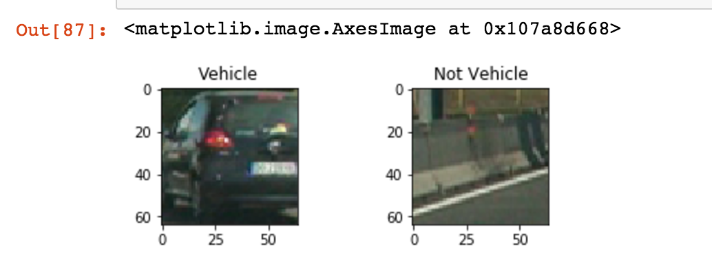
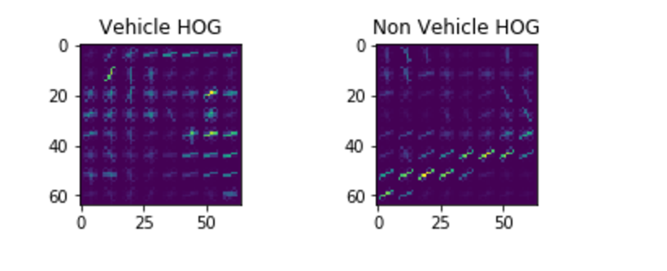
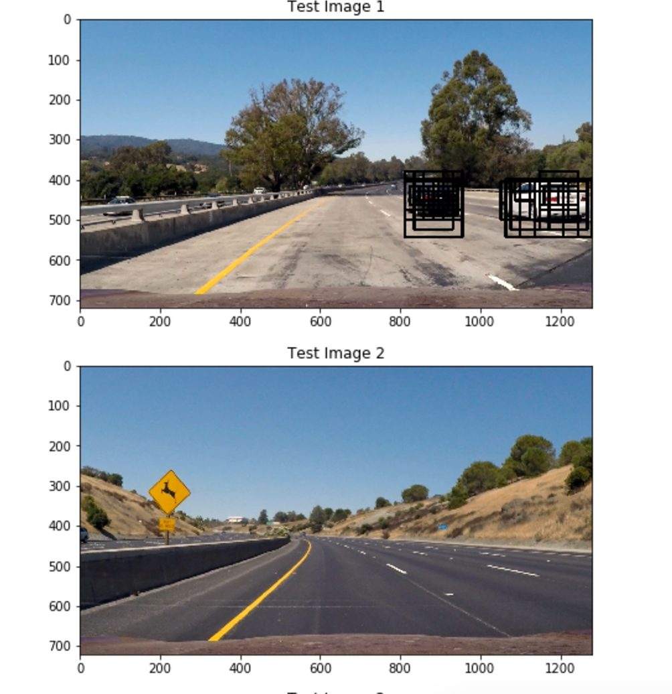
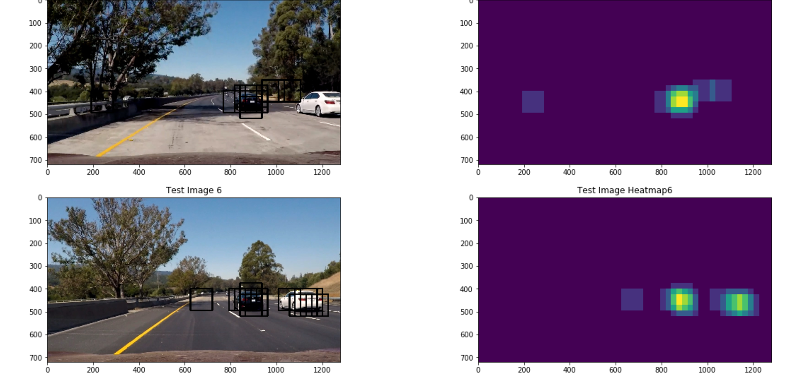
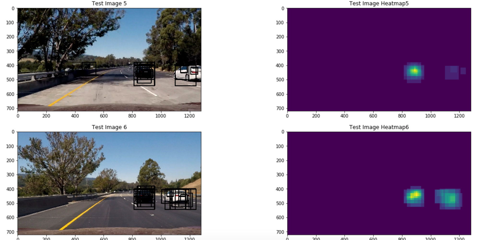
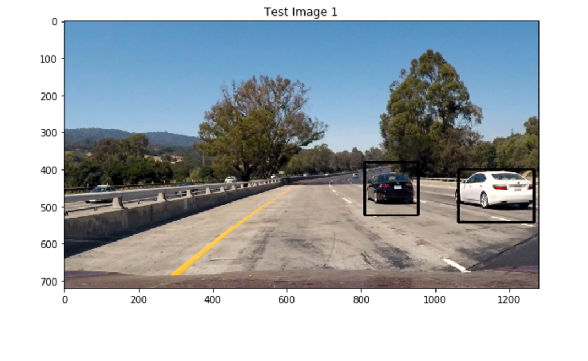

**Vehicle Detection Project**

## [Rubric](https://review.udacity.com/#!/rubrics/513/view) Points
###Here I will consider the rubric points individually and describe how I addressed each point in my implementation.  

---
###Writeup / README

####1. Provide a Writeup / README that includes all the rubric points and how you addressed each one.  You can submit your writeup as markdown or pdf.  [Here](https://github.com/udacity/CarND-Vehicle-Detection/blob/master/writeup_template.md) is a template writeup for this project you can use as a guide and a starting point.  

You're reading it!

###Histogram of Oriented Gradients (HOG)

####1. Explain how (and identify where in your code) you extracted HOG features from the training images.

In the 4th cell of the ipython notebook, I experimented with different color spaces and parameters and looked at the output for random vehicle and non-vehicle images. I first visualized some random images 

Then I used the extract_features_one_img function (line 89 cell 2) which calls get_hog_features (line 4 cell 2). This uses the skimage.hog() function with the parameters passed. 

Here is an example using the `YUV` color space and HOG parameters of `orientations=9`, `pixels_per_cell=(8, 8)` and `cells_per_block=(2, 2)` and hog channel 0:

I extracted the hog features from the whole training set in cell 4 and continued to refine these HOG parameters.

####2. Explain how you settled on your final choice of HOG parameters.

I tried different hog parameters and also experimented with using spatial and color features. I visualized the output of different HOG parameters on random training data (cell 4). I also applied the feature extraction to the training set and then calculated my test accuracy for that classifier. Some parameters allowed my test accuacy to be greatly improved, such as using all HOG channels instead of just one, increasing orient to 9 and 2 cells per block. I also noticed using converting the imgae to YUV instead of using RBG imroved results.

####3. Describe how (and identify where in your code) you trained a classifier using your selected HOG features (and color features if you used them).

In cell 5 I extracted HOG, color histogram, and spatial binning features to train a linear SVC classifier. I created a vertical stack of feature and non feature vectors and normalized the features that I extracted using sklearn StandardScaler(). I created the labels by generating 0s for non-vehicles and 1s for vehicles.

Then I split the data into training and validation sets to test out how well the classifier was doing before testing on the actual images. I used a linear svc (used sklearn) and fit it to the data (line 47). Then I used svc.score on the reserved set to get an idea how well the classifier was doing.

###Sliding Window Search

####1. Describe how (and identify where in your code) you implemented a sliding window search.  How did you decide what scales to search and how much to overlap windows?

In cell 6, I experimented with different scales and overlap for the sliding window search. First I got a list of the windows with slide_window (cell 2 line 141). I tried different y_start_stop and x_start_stop to test different cropping schemes, window sizes, and window overlap. Then I used search_windows (cell 2 line 186) which extracts the features from the window and uses the classifier to predict whether or not the window contains a vehicle.

In cell 7, I tried to extract the HOG images first and then use hog sampling, but I was getting a lot more false positives so I decided to finetune my first approach. In cell 8, I tried using multiple sized windows to generate a heatmap. I used different window scales for different areas of the image (because cars closer to the horizon would be smaller, etc). I also experimented with different amounts of overlap to be able to detect all the vehicles without increasing the number of windows too much (this also became important when I applied a threshold to the heatmap).

####2. Show some examples of test images to demonstrate how your pipeline is working.  What did you do to optimize the performance of your classifier?

I used 3-channel YUV HOG features, spatially binned color and histograms of color in the feature vector which worked pretty well. This improved the performance over using only 1 channel or HOG features, or leaving out spatially binned color or hisograms of color. I used 3 scales of images for different parts of the images, which was better able to detect different size cars in different parts of the images. 
 
Here are some example images:

---

### Video Implementation

####1. Provide a link to your final video output.  Your pipeline should perform reasonably well on the entire project video (somewhat wobbly or unstable bounding boxes are ok as long as you are identifying the vehicles most of the time with minimal false positives.)
Here's a [link to my video result](./project_video_output.mp4)

####2. Describe how (and identify where in your code) you implemented some kind of filter for false positives and some method for combining overlapping bounding boxes.

From the positive window detections I created a heatmap and then thresholded the result so that only areas where there were at least two overlapping detections. This helped elliminate false positives and combine the overlapping boundary boxes. This is at the end of the method defined in cell 9 (and the functions called there are defined in cell 2). Then I used scipy.ndimage.measurements.label() to identify the continuous positive sections of the images (cell 10) and drew bounding boxes around these blobs.

I recorded the positions of positive detections in each frame of the video.  From the positive detections I created a heatmap and then thresholded that map to identify vehicle positions.  I then used ` to identify individual blobs in the heatmap.  I then assumed each blob corresponded to a vehicle.  I constructed bounding boxes to cover the area of each blob detected.  

These are images and their thresholded heatmaps.

### This is the image after the bounding box has been applied to the labels extracted from the thresholded heatmap:

---

###Discussion

####1. Briefly discuss any problems / issues you faced in your implementation of this project.  Where will your pipeline likely fail?  What could you do to make it more robust?

The pipeline might fail with weirdly colored cars (striped for example) or in different road conditions, such as rain or snow that might interfere with the images. Also ocassionally there are 2 bounding boxes around car instead of one- the thresholding of the heatmap cound be improved to have a blur effect -- not turn to zero if many nearby pixels are positive in heat map i.e. region in middle of car.  Also the bounding boxes are jumpy from frame to frame, this could be improved by averaging the position of bounding box and heat map over time. 

In the video, the really far away cars weren't picked up. It might be good to use an even smaller window size just right along the horizon for these vehicles.

